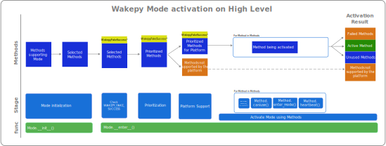
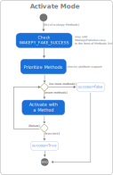
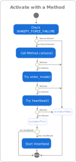

# Wakepy Mode Lifecycle

## Introduction to Modes

[**Modes**](#wakepy-modes) are what you enter, stay in for a while, and exit from. For example, [keep.running](#keep-running-mode) is a Mode where automatic suspend is inhibited. Each Mode is implemented with one or more [Methods](#wakepy-methods) like [org.gnome.SessionManager](#org-gnome-sessionmanager) or [SetThreadExecutionState](#windows-stes).

### Using Wakepy Modes in python

Modes can be used in two ways. As **context managers**:

(simple-example-code-block)=
```{code-block} python
from wakepy import keep

with keep.running():
    USER_CODE
```

which is roughly equal to (See: [PEP-343](https://peps.python.org/pep-0343/))

```{code-block} python
mode = keep.running()
mode.__enter__()
try:
    USER_CODE
finally:
    mode.__exit__() # cleanup guaranteed even if Exceptions in USER_CODE
```

and with the **decorator syntax**:

```{code-block} python
from wakepy import keep

@keep.running
def long_running_task():
    USER_CODE
```

which is roughly equal to

```{code-block} python
from wakepy import keep

def long_running_task():
    with keep.running():
        USER_CODE
```


```{note}
The rest of this document uses the context manager syntax in the examples because it makes the Mode lifecycle steps more explicit. The decorator syntax is just some syntactic sugar and uses a context manager internally automatically every time the decorated function is called.
```

### Wakepy Mode Activation on High Level

The diagram below illustrates how wakepy selects and prioritizes *Methods*, then activates a *Mode*.

1. **Selected Methods**: When a {class}`~wakepy.Mode` instance is created, all Methods that support the Mode are filtered using the optional `omit` or `methods` input arguments to form the *Selected Methods* list.
2. **WakepyFakeSuccess**: The [`WAKEPY_FAKE_SUCCESS`](#WAKEPY_FAKE_SUCCESS) option may add an additional WakepyFakeSuccess Method to the beginning of the list.
3. **Prioritization**: The *Prioritized Methods* list is created by reordering Selected Methods according to the `methods_priority` argument.
4. **Platform Support**: Methods incompatible with the current platform are removed.
5. **Activation**: During activation, each platform-supported Method is tried in priority order until activation succeeds or no Methods remain.
6. **ActivationResult**: The results are collected in an {class}`~wakepy.ActivationResult` instance.


:::{figure-md} fig-wakepy-mode-activation-high-level
{width=1000px}

*How wakepy methods are selected*
:::


## Overview of the Mode Lifecycle

To make it easier to discuss what is happening, we use the code from [this code block](simple-example-code-block) and split the Mode initialization and activation in the [*context expression*](https://peps.python.org/pep-0343/#standard-terminology) into two statements and add comments and line numbers:

```{code-block} python
:lineno-start: 1
from wakepy import keep

# Returns an instance of Mode
mode = keep.running()
# Inactive

with mode:
    # Active OR Activation Failed
    USER_CODE
    # Active OR Activation Failed

# Inactive
```
We can now compare the code with the actions in the [Activity Diagram](#mode-activity-diagram).

### Mode Activity Diagram


The wakepy.Mode Activity Diagram in {numref}`fig-mode-activity-diagram` shows the *Activities* related to activating, working in and deactivating a mode. The arrows on left side show how these relate to python code. The possible States are marked between activities in cursive font, in light blue.

:::{figure-md} fig-mode-activity-diagram
{width=660px}

*The Activity Diagram related to activating and deactivating wakepy Modes. Different states are marked as cursive light blue font.*
:::


## Creating a Mode instance

This corresponds to the action "Create Mode" in {numref}`fig-mode-activity-diagram`. When you create an instance of the {class}`~wakepy.Mode` class with


```{code-block} python
:emphasize-lines: 4
:lineno-start: 1

from wakepy import keep

# Returns an instance of Mode
mode = keep.running()
# Inactive

```

the instance will initially be in the *Inactive* state. When using the decorator syntax, the python interpreter creates a new Mode instance every time it calls the decorated function.


## Activating a Mode

In order to set your system into a Mode, you need to activate it ("Activate Mode" in {numref}`fig-mode-activity-diagram`). As Modes are [context managers](https://peps.python.org/pep-0343/) it is possible to simply use:

```{code-block} python
:emphasize-lines: 4
:lineno-start: 7
mode = keep.running()

# Inactive
with mode: # activates
    # Active OR Activation Failed
    USER_CODE
    # Active OR Activation Failed

# Inactive

```

This will put the Mode into *Active* or *Activation Failed* state (depending of the outcome of the activation process). Here is the same using the decorator syntax:


```{code-block} python
:emphasize-lines: 11
:lineno-start: 1
mode = keep.running()

@keep.running
def long_running_task():
    # Active
    USER_CODE
    # Active


# Inactive
long_running_task() # activates and deactivates
# Inactive

```

The python process creates a new Mode context manager instance and uses it every time a decorated function is called. If the process enters a *Activation Failed* state, the *Action on Fail* occurs (See: {numref}`fig-mode-activity-diagram`). This action may be an exception, a warning, or a custom action as determined by the {func}`on_fail <wakepy.keep.running>` input parameter.


The {numref}`fig-activate-mode-activity-diagram` presents an activity diagram from the "Activate Mode" step of {numref}`fig-mode-activity-diagram`. The steps are:
- ***Check WAKEPY_FAKE_SUCCESS***: If the [`WAKEPY_FAKE_SUCCESS`](#WAKEPY_FAKE_SUCCESS) environment variable is set to a truthy value, the `WakepyFakeSuccess` method is inserted at the beginning of the methods list. This special method has `.caniuse()`, `.enter_mode()`, `.heartbeat()` and `.exit_mode()` which always succeed without making any real system calls, which is useful for testing.
- ***Prioritize Methods***: Methods are prioritized with `methods_priority` from the user, if given.
- ***Platform Support***: Methods not supported by the current platform are removed from the list of methods to be tried. (Check current platform against `Method.supported_platform`) 
- ***Activate with a Method***: Try to activate the Mode using the Method with highest priority. This is explained in more detail in the [next section](#section-activating-with-a-method). Note that only *one* Method is ever used to activate a Mode; the first one which does not fail, in priority order.

This process happens in the `Mode._activate` method and it returns an `ActivationResult` object, the used `wakepy.Method` instance (if successful)  and a `Heartbeat` instance (if used).

:::{figure-md} fig-activate-mode-activity-diagram
{width=430px}

*The Activity Diagram for the "Activate Mode" action of the {numref}`fig-mode-activity-diagram`.*
:::


(section-activating-with-a-method)=
### Activate with a Method

The {numref}`fig-activate-with-a-method` presents the activity diagram for the "Activate with a Method" action from the {numref}`fig-activate-mode-activity-diagram`. This is what wakepy does with each Method, in order:


1. **Check WAKEPY_FORCE_FAILURE**: If the [`WAKEPY_FORCE_FAILURE`](#WAKEPY_FORCE_FAILURE) environment variable is set to a truthy value, the activation is forced to fail immediately. This is useful for testing error handling. If both [`WAKEPY_FAKE_SUCCESS`](#WAKEPY_FAKE_SUCCESS) and `WAKEPY_FORCE_FAILURE` are set, `WAKEPY_FORCE_FAILURE` takes precedence.
2. **Check requirements**: Checks requirements using `Method.caniuse()`. Some Methods could require a certain version of a specific Desktop Environment, a version of 3rd-party software, or some D-Bus service running. During this step, if some 3rd-party software has known bugs on certain versions, the Method may be dismissed.
3. **Activate the Mode**: Tries to activate the Mode using `Method.enter_mode()`, if defined.
4. **Start heartbeat**: Tries to start the heartbeat using `Method.heartbeat()`, if defined. This will run in a separate thread.

```{admonition} Heartbeat is not yet supported
:class: note

Heartbeat support is not yet fully implemented. Ticket: [wakepy/wakepy#109](https://github.com/wakepy/wakepy/issues/109)
```

If at least one of `Method.enter_mode()` or `Method.heartbeat()` is defined and they do not raise exceptions, the Mode activation is successful. This process happens in the `activate_method` function and it returns a `MethodActivationResult` object and a `Heartbeat` instance (if used and activation was successful).
:::{figure-md} fig-activate-with-a-method
{width=430px}

*The Activity Diagram for the "Activate with a Method" action of the {numref}`fig-activate-mode-activity-diagram`.*
:::


## Staying in a Mode

This part of the Mode lifecycle is where the user code ("USER_CODE" in {numref}`fig-mode-activity-diagram`) runs. This could be a simple while loop with sleeps until `KeyboardInterrupt`, or a long-running task. During this activity, the Mode will be in *Active* or *Activation Failed* state (as seen from {numref}`fig-mode-activity-diagram`). If the used Method has a `heartbeat()` method, it will be called every `Method.heartbeat_period` seconds in a separate heartbeat thread.

## Deactivating a Mode

The "Deactivate Mode" activity in {numref}`fig-mode-activity-diagram` occurs automatically when the `with` block is exited; between lines 10 and 11 in the code below:

```{code-block} python
:emphasize-lines: 4,5
:lineno-start: 7

with mode:
    # Active
    USER_CODE
    # Still Active

# Inactive
```

This is handled automatically by the context manager. What actually gets called is `Mode.__exit__()`, which in turn calls `Mode._deactivate()`, which triggers deactivating the used Method. Deactivating a Method means stopping the `Method.heartbeat()` calls (if heartbeat is used) and calling `Method.exit_mode()`.

```{note}
When using the `with` statement or the decorator syntax, the context manager takes care of calling `Mode._deactivate()` even if `USER_CODE` raises an exception.
```

